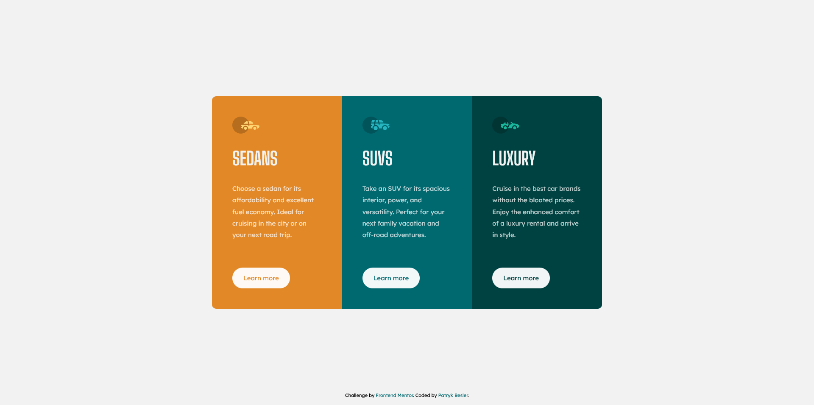

# Frontend Mentor - 3-column preview card component solution

This is a solution to the [3-column preview card component challenge on Frontend Mentor](https://www.frontendmentor.io/challenges/3column-preview-card-component-pH92eAR2-). Frontend Mentor challenges help you improve your coding skills by building realistic projects.

## Table of contents

-   [Overview](#overview)
    -   [The challenge](#the-challenge)
    -   [Screenshot](#screenshot)
    -   [Links](#links)
-   [My process](#my-process)
    -   [Built with](#built-with)
    -   [What I learned](#what-i-learned)
    -   [Continued development](#continued-development)
    -   [Useful resources](#useful-resources)
-   [Author](#author)

**Note: Delete this note and update the table of contents based on what sections you keep.**

## Overview

### The challenge

Users should be able to:

-   View the optimal layout depending on their device's screen size
-   See hover states for interactive elements

### Screenshot

### Links

-   [Solution Page](https://www.frontendmentor.io/solutions/-3column-preview-card-component-ffZ6IsyR9)
-   [Live Site](https://beslerpatryk.github.io/column_preview_card_component/)

## My process

### Built with

-   Semantic HTML5 markup
-   CSS custom properties
-   Flexbox
-   Mobile-first workflow

### What I learned

This project wasn't hard but still I learned thing or two about HTML and CSS. I start to notice that I feel more comfortable with writing code, positioning elements and setting up layouts. At the same time I pick up a lot of essential knowledge about best practices both for HTML and CSS.

-   h1 - there should be always at least one h1 tag on the page. However, it is best practice to have only one h1 tag for the page. But what happens in projects like those, where there is no definite one heading that is more important than others? You can create hidden h1 tag only for screen readers. I have to dive more deeply into the topic of accessibility to fully understand the idea but it is definitely something that I wouldn't consider doing before i.e creating tags only for screenreaders.
-   min-height: 100% on html and body elements - ensure the webpage always takes the 100% of window estate. It is great for setting up the page and allows to align everything easily. At the same time it makes sure that the page can still grow if there is a need for that
-   dash > underscore - I have recently learnt that using dashed for file naming is better than underscores for several reasons (underscore is not always seen by some search engines as well as it is more readable in case the file name is inside url)

### Continued development

grid vs flexbox - I still don't' fully understand how elements behave under those display properties. I do have some pretty basic understanding but it is still not enough. The biggest issue for me is confusing what is the part of the flexbox/grid and what is not. For example it took me a while to realize that in order to align items inside each column I needed each section to also be another flexbox. Instead I got confused and tried some random things to see if any of it would work.

## Author

-   Frontend Mentor - [@beslerpatryk](https://www.frontendmentor.io/profile/beslerpatryk)
-   Github - [@beslerpatryk](https://github.com/beslerpatryk)
